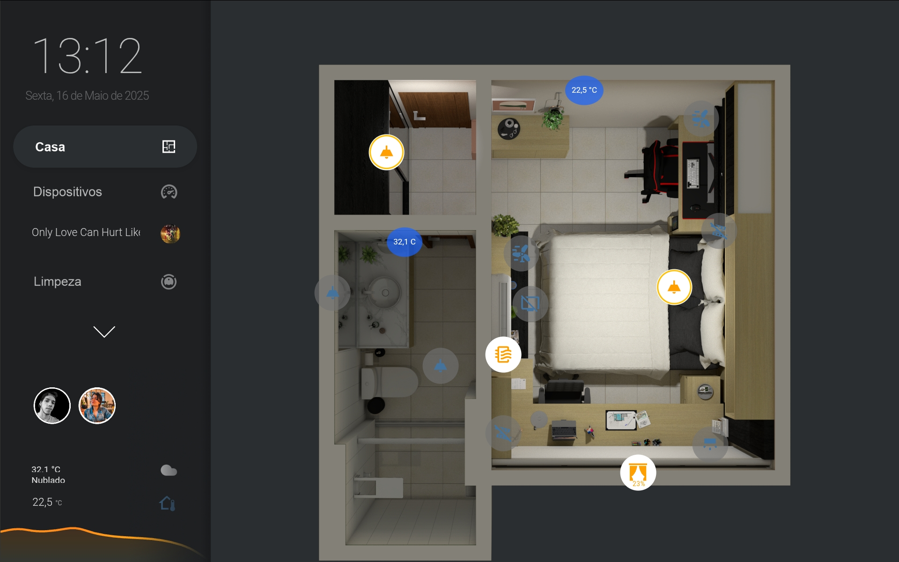
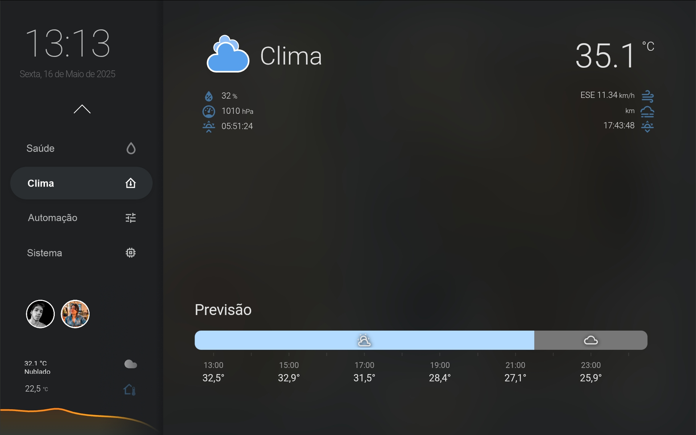
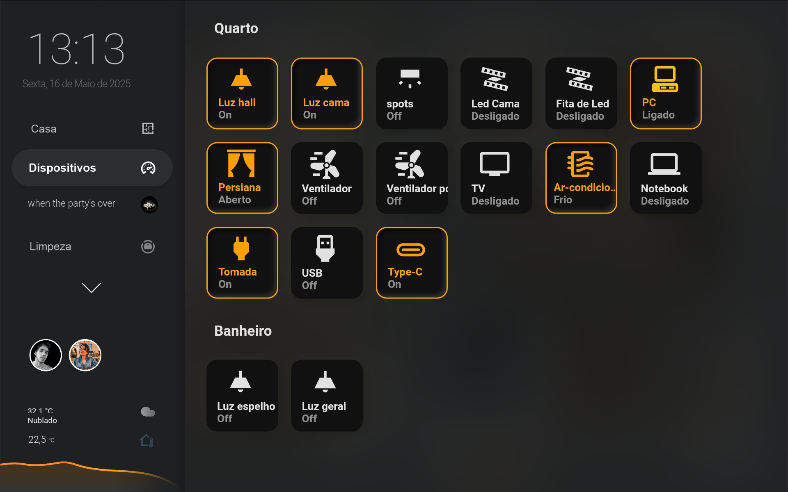

# 🏠 Projeto de Automação com Home Assistant

<div align="center">
  
</div>

Este projeto utiliza o **Home Assistant**, uma plataforma open-source para automação residencial, com configurações escritas em **YAML**.

Com foco em conforto, segurança e praticidade, as automações desenvolvidas aqui controlam dispositivos conectados e otimizam tarefas do dia a dia em uma smart home.

---

## 🔌 Tecnologias e Integrações Utilizadas

- **Home Assistant (YAML)** – Automação local e altamente personalizável.
- **MQTT** – Comunicação entre sensores e controladores.
- **Dispositivos ESPHome / Tasmota** – Para sensores e atuadores Wi-Fi.
- **Assistentes de voz** – Google Assistant / Alexa.
- **Zigbee e Z-Wave** – Protocolos de comunicação sem fio para casa inteligente.

---

## 💡 Exemplos de Automação

- Acionamento de luzes com base em sensores de presença e horário.
- Notificações em tempo real para eventos como abertura de portas ou presença de movimento.
- Controle de climatização automático com base na temperatura ambiente.
- Rotinas personalizadas como “Modo Boa Noite” ou “Cheguei em Casa”.

---

<div align="center">
  
</div>

---

## 🌐 Vantagens da Plataforma

- **Local-first**: suas automações funcionam mesmo sem internet.
- Interface totalmente personalizável com dashboards Lovelace.
- Grande comunidade e suporte para mais de 1000 dispositivos e serviços.

---

<div align="center">
  
</div>

---

## 📁 Organização do Projeto

```
📦 config/
 ┣ 📂 automations/
 ┣ 📂 scripts/
 ┣ 📂 sensors/
 ┣ 📂 scenes/
 ┗ configuration.yaml
```

---

<div align="center">
  
</div>

---

> 🔒 Este projeto prioriza a **privacidade dos dados**, rodando localmente sem necessidade de serviços em nuvem externos.

